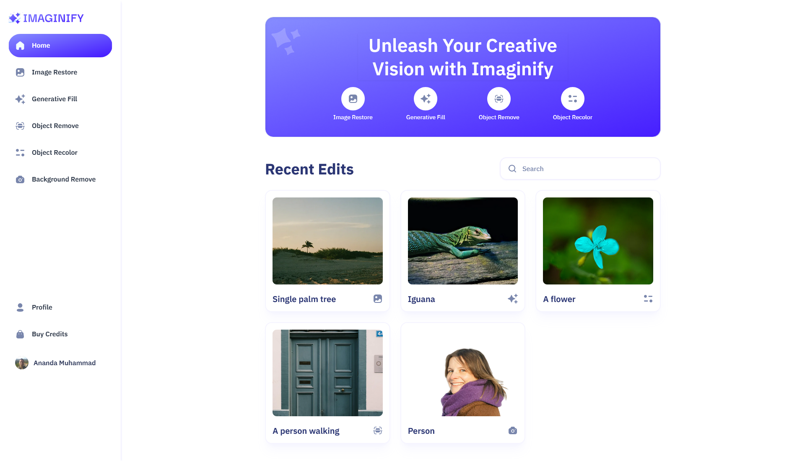
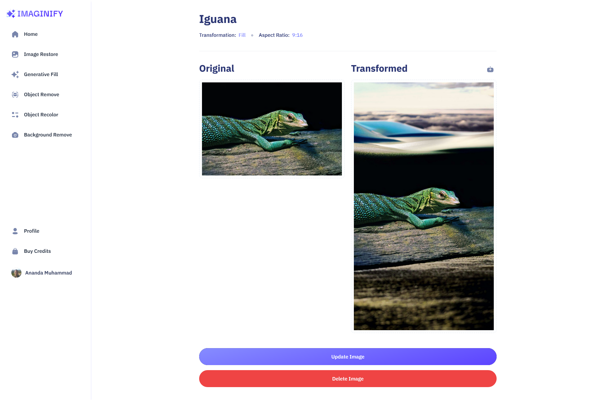
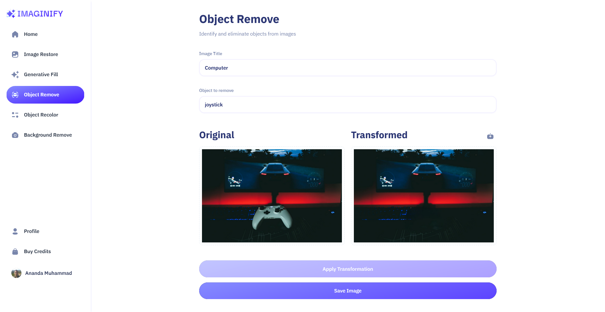
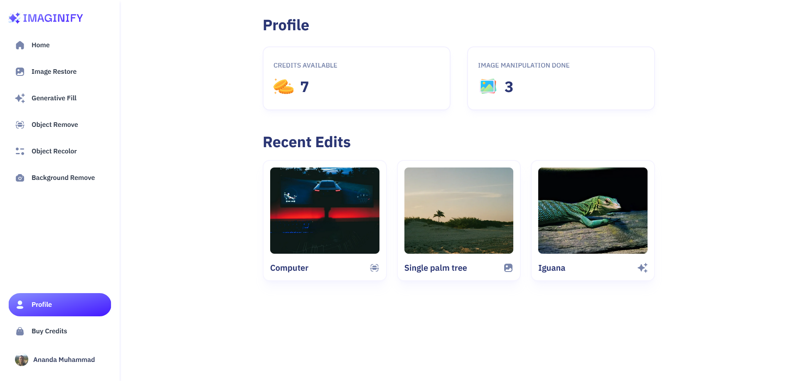

# Imaginify 

## Contents

- [Description](#description)
- [Features](#features)
- [Installation](#installation-for-development)
- [Tech Stack](#tech-stack)
- [Screenshoots](#screenshoots)
- [Imaginify](#imaginify)

## Description

Imaginify is a SaaS web app which allow you to do image processing such as background/object removal, image restore, generative fill, and object recolor using Next.js 14, Clerk, MongoDB, Cloudinary AI, and Stripe. 

## Features

### User Onboarding

Using Clerk as authentication & user management, it'll ensures a smooth onboarding experience. Users can set their profile image, name, username, and add a bio to personalize their profiles.

### Background / object removal

Remove background or you can type a prompt to remove specific object from the images

### Image restore

Refining images by removing noise and imperfections.

### Generative fill
Enhance images dimension using AI which adding more context to the images

### Object recolor
Identify and recolor objects from the image

### Payment
Integrates a secure payment infrastructure using stripe

### Search

User have the ability to search for recent edited images by other users

## Installation for Development

Use the package manager [npm](https://www.npmjs.com/get-npm) to install all required dependecies.
```bash
npm install
```
and then:
```bash
npm run dev
```

## Tech Stack

- Framework: [Next.js](https://nextjs.org/)
- Styling: [Tailwind CSS](https://nextjs.org/)
- UI Library: [shadcn/ui](https://ui.shadcn.com/) (for form templates)
- Authentication: [Clerk](https://clerk.com/)
- Payment: [Stripe](https://dashboard.stripe.com/)
- Cloudinary: [Cloudinary](https://cloudinary.com/)
- Server: Node.js/Express.js
- Database: MongoDB with Mongoose

## Screenshoots

<div align="center">
    
    
    
    
    
    
</div>

## Demo Imaginify

Let's try it.

<a href="https://imaginify-three-pink.vercel.app/" target="_blank">
  
</a>